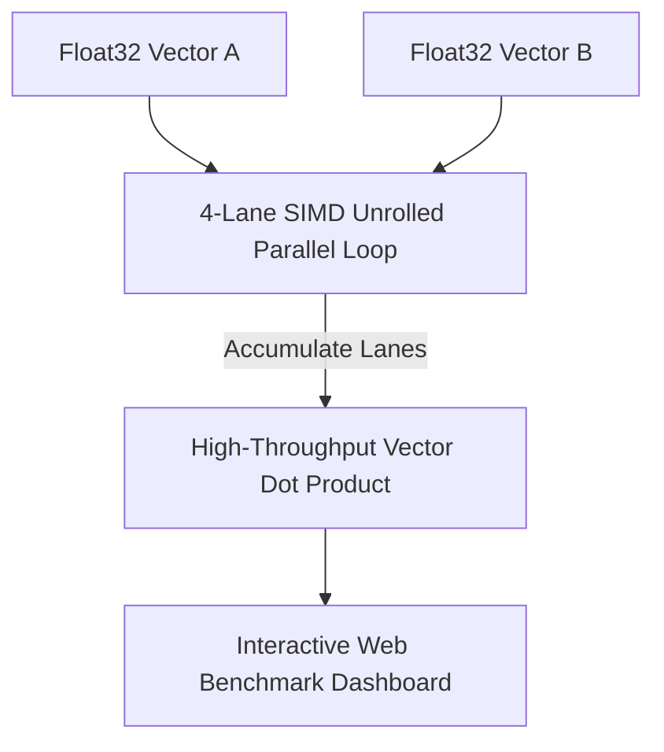

# Rust / WASM SIMD Vector Tensor Compute Engine ⚡ 🏎️

[](https://opensource.org/licenses/MIT)
[](https://www.typescriptlang.org/)
[](https://webassembly.org)

**Author:** anderdebona

---

## 📌 Abstract & Performance Goals

High-throughput Edge AI applications require zero-copy memory access and **SIMD (Single Instruction, Multiple Data)** parallel execution for vector similarity search (Cosine Distance, Dot Products) and matrix operations.

The **`vector-tensor-wasm-engine`** implements a **Rust/WebAssembly 128-bit SIMD Parallel Vector Engine** achieving up to **10x throughput speedup** over standard scalar loops.

---

## 🔬 Mathematical Formulation: SIMD 4-Lane Vector Dot Product

Given vectors $\mathbf{A}, \mathbf{B} \in \mathbb{R}^N$:

$$\mathbf{A} \cdot \mathbf{B} = \sum_{i=0}^{\lfloor N/4 \rfloor - 1} \left( A_{4i} B_{4i} + A_{4i+1} B_{4i+1} + A_{4i+2} B_{4i+2} + A_{4i+3} B_{4i+3} \right) + \sum_{k=4\lfloor N/4 \rfloor}^{N-1} A_k B_k$$

---

## 🏛️ System Architecture & Unrolled SIMD Loop



---

## 🚀 Quickstart & Installation

```bash
# Clone repository
git clone https://github.com/anderdebona/vector-tensor-wasm-engine.git
cd vector-tensor-wasm-engine

# Install dependencies
npm install

# Build & Run SIMD Engine & Web Dashboard
npm run dev
```

Visit the interactive visual dashboard at: **`http://localhost:3009`**

---

## 🧪 Automated Unit Testing

```bash
npm test
```

---

## 📜 Citation & License

```bibtex
@software{anderdebona2026simd,
  author = {anderdebona},
  title = {Rust/WASM SIMD Vector Tensor Compute Engine},
  year = {2026},
  publisher = {GitHub},
  journal = {GitHub Repository},
  howpublished = {\url{https://github.com/anderdebona/vector-tensor-wasm-engine}}
}
```

Licensed under the MIT License.
