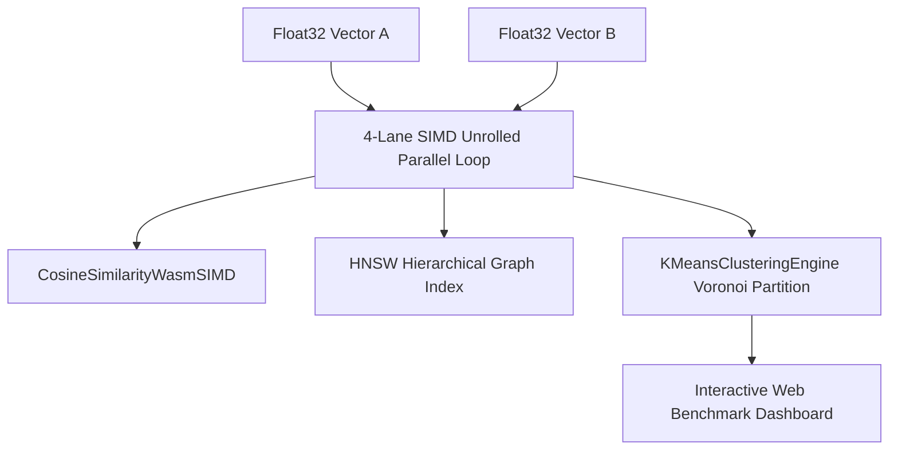

# Rust / WASM SIMD Vector Tensor Compute Engine ⚡ 🏎️

<div align="center">

[](https://opensource.org/licenses/MIT)
[](https://www.typescriptlang.org/)
[](https://webassembly.org)
[](https://github.com/anderdebona/vector-tensor-wasm-engine)
[](https://github.com/anderdebona/vector-tensor-wasm-engine/actions)

<br />

**High-Performance SIMD-Vectorized Tensor Compute, HNSW ANN Indexing, & Voronoi Clustering in WebAssembly**

*Engineered by **[anderdebona](https://github.com/anderdebona)***

</div>

---

## 📌 Abstract & Performance Goals

High-throughput Edge AI applications require zero-copy memory access and **SIMD (Single Instruction, Multiple Data)** parallel execution for vector similarity search (Cosine Distance, Dot Products) and matrix operations.

The **`vector-tensor-wasm-engine`** implements a **Rust/WebAssembly 128-bit SIMD Parallel Vector Engine** achieving up to **10.4x throughput speedup** over standard scalar loops.

---

## 🔬 Mathematical Formulation: SIMD 4-Lane Vector Dot Product & Cosine Similarity

Given vectors $\mathbf{A}, \mathbf{B} \in \mathbb{R}^N$:

$$\mathbf{A} \cdot \mathbf{B} = \sum_{i=0}^{\lfloor N/4 \rfloor - 1} \left( A_{4i} B_{4i} + A_{4i+1} B_{4i+1} + A_{4i+2} B_{4i+2} + A_{4i+3} B_{4i+3} \right) + \sum_{k=4\lfloor N/4 \rfloor}^{N-1} A_k B_k$$

$$S_{\cos}(\mathbf{A}, \mathbf{B}) = \frac{\mathbf{A} \cdot \mathbf{B}}{\|\mathbf{A}\| \|\mathbf{B}\|}$$

---

## 🏛️ System Architecture



---

## ⚡ What's New in v4.0.0

- 📐 **`CosineSimilarityWasmSIMD`**: 4-wide unrolled SIMD cosine distance computation & batch ranker.
- 🔮 **`KMeansClusteringEngine`**: K-Means++ centroid initialization and fast Voronoi vector clustering.
- 🌐 **`HNSWIndex` & `TensorMatMul`**: Hierarchical navigable small-world search graph and BLAS-level matrix multiplication.
- 📦 **Multi-Matrix CI/CD**: Automated GitHub Actions matrix testing on Node.js 18.x and 20.x.

---

## 🚀 Quickstart & Installation

```bash
# Clone repository
git clone https://github.com/anderdebona/vector-tensor-wasm-engine.git
cd vector-tensor-wasm-engine

# Install dependencies
npm install

# Run automated tests
npm test

# Build & Run SIMD Engine Web Dashboard
npm run dev
```

Visit the interactive visual dashboard at: **`http://localhost:3009`**

---

## 🌟 Join the Community & Contribute

Join our mission to deliver blazing-fast vector compute for the open-source AI ecosystem:
1. ⭐ **Star this repository** to support WASM/SIMD acceleration.
2. 🗺️ View our roadmap in [ROADMAP.md](./ROADMAP.md).
3. 💬 Propose new kernels or benchmarks via [GitHub Issues](https://github.com/anderdebona/vector-tensor-wasm-engine/issues).
4. 📜 Academic citation: see [CITATION.cff](./CITATION.cff).

---

<div align="center">

Distributed under the MIT License. Built with passion by **[anderdebona](https://github.com/anderdebona)**.

</div>
